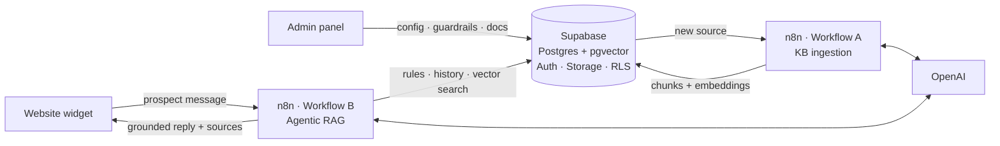

# LeadPilot AI

**An AI sales agent that answers prospects from a company's own knowledge, inside guardrails the company controls, and hands sales the context it needs.**

Built as a product-management cohort project: problem definition → PRD → prototype → working backend → evaluation. The demo customer is **LegalGraph AI**, a fictional legal-tech company whose website runs LeadPilot's assistant, *Maya*.

| Prospect's view: Maya on the customer's website | Admin's view: the LeadPilot admin panel |
|---|---|
|  |  |

---

## The problem

B2B companies pay to bring prospects to their website, then leave them alone with a contact form. Interested buyers have questions *before* they're ready to talk to sales, and when a lead does reach an SDR, it arrives with no context: what they asked, what they need, whether they're even qualified.

**Job to be done:** *When a prospect engages with my website or campaign, help them get the information they need while understanding their intent, qualifying them, and giving my sales team the context to take the right next action.*

| Persona | Needs |
|---|---|
| **Marketing / RevOps admin** (buyer) | Put an assistant on the site without engineering; control what it can and can't say |
| **Prospect** (end user) | Straight, accurate answers now, not "book a call to find out" |
| **SDR / BDR** | Leads that arrive with intent, requirements and qualification signals |

**North Star:** *Qualified Lead → Next Action Rate* (the % of qualified prospects for whom the agent recommends or starts the right next step). Full problem framing, metrics, risks and prioritisation: **[PRD](docs/PRD.md)**.

## What it does today

- **Admins configure the agent without code:** name, greeting, avatar, tone, company description, allowed and blocked topics, restricted claims, fallback message, escalation rule, and what personal data it may ask for.
- **Admins manage the knowledge base:** upload PDFs/DOCX or add the company website. Status is shown honestly (`Uploaded → Processing → Ready / Failed + reason`), with re-index, and an auto-drafted company profile from the crawl.
- **Prospects chat with Maya on the website.** Answers come **only** from the company's knowledge and cite their source. When the knowledge doesn't cover a question, Maya says so and offers a human instead of guessing.
- **Every conversation is stored** with the sources each answer used and any guardrail triggers, ready for qualification and the leads view (next).

## How it works



**Agentic RAG, not a fixed pipeline.** An *intent router* decides whether the knowledge base is even needed (greetings skip it), a *query rewriter* turns follow-ups like *"and how much is that one?"* into real search queries, and a *tool-using agent* searches, judges the results, and **re-searches up to 3 times** before falling back.

**Guardrails in three layers, all driven by the admin panel:** (1) the admin's rules are compiled into the agent's instructions on every message; (2) a pre-check refuses blocked, off-topic and prompt-injection messages before the agent runs; (3) a post-check reviews the drafted reply against blocked topics and restricted claims.

**Security is real, not mocked:** admin login, Row Level Security on every table, anonymous visitors limited to a 6-field public view, company-scoped vector search enforced *in the database*, and the master key kept only in n8n.

→ [Architecture](docs/architecture.md) · [n8n workflows](n8n/README.md) · [Database](supabase/README.md)

## Key product decisions

The full list, with options considered and trade-offs, is in the **[decision log](docs/decision-log.md)**. The ones that shaped the product:

| Decision | Why | Trade-off accepted |
|---|---|---|
| **Cut the video/voice avatar; chat only** | Voice was out of MVP scope and didn't move the North Star | A less flashy demo |
| **Fallback over guessing** | A confident wrong answer about pricing or security costs more than "let me connect you with the team" | Some questions go unanswered; measured in evals |
| **Guardrails the customer controls, checked before *and* after the answer** | The core promise: each company decides what its agent may say | 1–2 extra model calls per message |
| **Honest ingestion statuses** | A fake "Ready" tells the admin the agent knows something it doesn't | A less "magical" UI |
| **Persistent, company-scoped vector store** (not the in-memory store from the course template) | The in-memory store is wiped on restart and can't separate customers | More setup (SQL, metadata, triggers) |
| **Build answers before qualification** | Qualification needs a working conversation and stored messages first | Until it ships, the demo reads as a guarded RAG bot |

## Evaluation

27 test cases in **[`evals/`](evals/)**, each mapped to a PRD metric:

| Group | What passing means |
|---|---|
| 13 KB questions (incl. a multi-turn follow-up) | Correct fact, source cited |
| 4 not-in-KB questions | Fallback message, no invented answer |
| 7 blocked / off-topic / prompt-injection attempts | Refuses, never leaks the forbidden content or its instructions |
| 3 small talk / demo requests | Answered without searching the KB |

The runner (`python3 evals/run_evals.py`) scores replies automatically, records latency and sources, and leaves a column for human review.

> **Results:** *pending first live run.* The suite is built and tested against a mock agent. Numbers and failures will be published in [`evals/`](evals/README.md#results) once the chat workflow is live.

## Status

| Area | Status |
|---|---|
| Problem definition, PRD, prioritisation, roadmap | ✅ [docs/PRD.md](docs/PRD.md) |
| Admin panel (agent, guardrails, KB) on Supabase with auth + RLS | ✅ |
| KB ingestion: PDF/DOCX + website crawl → pgvector (Workflow A) | ✅ built · 🟡 live test in progress |
| Agentic RAG chat with 3-layer guardrails (Workflow B) | 🟡 designed and documented · being built |
| Website widget wired to the agent and the admin settings | ✅ |
| Evaluation suite | ✅ built · results pending |
| Lead qualification, conversation insights, leads view | ⏭️ next (the PRD's differentiator) |
| CRM handoff, demo booking, analytics | 🗓️ roadmap (P1) |

## Repo map

```
docs/            PRD, architecture, decision log, setup guide, design spec
admin-panel/     LeadPilot admin panel (single HTML file, Supabase JS)
website/         LegalGraph demo site + Maya widget (source/ + single-file build)
supabase/        All SQL: tables, RLS, storage, pgvector + RAG functions, ingestion trigger
n8n/             Workflow docs + Code-node scripts (workflow JSON exports go here)
knowledge-base/  Demo KB: LegalGraph product guide (PDF + HTML source)
evals/           Golden set, runner, results
```

**Stack:** Supabase (Postgres, pgvector, Auth, Storage, RLS, pg_net, Vault) · n8n Cloud (AI Agent, Text Classifier, Supabase Vector Store) · OpenAI (`text-embedding-3-small` + GPT mini) · vanilla HTML/CSS/JS.

**Run it yourself:** [docs/setup.md](docs/setup.md) (about an hour, free tiers).

## What I'd do next
1. **Qualification + insights + leads view:** admin-defined criteria, signals extracted from each conversation, and a deterministic qualified / not qualified / follow-up outcome, so SDRs get context instead of a bare email. This is the PRD's moat.
2. **Measure the North Star:** instrument next-action clicks and demo bookings per conversation and per campaign (`utm_source` is already stored).
3. **Harden for real traffic:** per-IP rate limits, a signed embed snippet per customer, robots.txt-aware crawling.

---

*LegalGraph AI and all its customers, figures and quotes are fictional demo data.*
Built by **Sarthak Gupta**.
