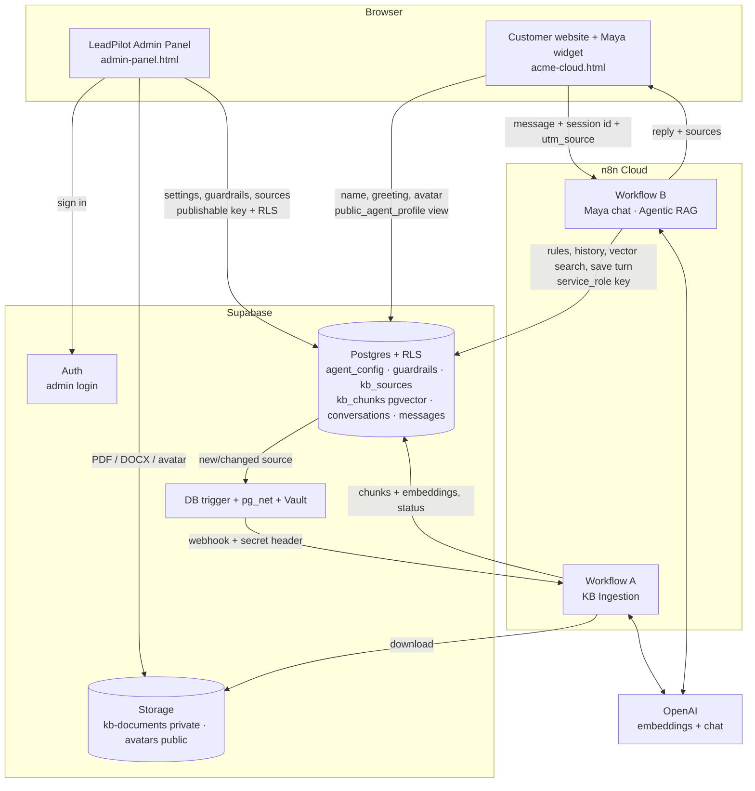

# Architecture

LeadPilot has four parts. **Supabase is the single source of truth**: the admin panel and website only read and write through it, and n8n does the heavy lifting.

## Who can do what

| Actor | Connects with | Can access |
|---|---|---|
| Admin (signed in) | Publishable key + Supabase Auth | Only their company's rows (RLS checks the `company_admins` guest list); upload/delete files in their company's storage folder |
| Website visitor | Publishable key, not signed in | **Only** `public_agent_profile` (name, greeting, avatar, tone). Everything else is revoked |
| n8n | `service_role` key (stored only in n8n credentials) | Everything; the only caller allowed to run the RAG/ingestion SQL functions |
| Supabase → n8n | pg_net with a shared secret header (secret in Vault) | Can only trigger Workflow A |

Public sign-ups are disabled. Vector search refuses to run unless a `company_id` filter is given, so one company can never retrieve another's chunks. This was tested with anonymous and signed-in probes.

## Data model

| Table | Holds | Written by |
|---|---|---|
| `companies` | Customer companies (one: the fictional Acme Cloud) | seed |
| `company_admins` | Which login administers which company | SQL (sign-ups off) |
| `agent_config` | Agent name, greeting, avatar, tone, company description, crawl-generated context draft | Admin panel · n8n (draft) |
| `guardrails` | Allowed and blocked topics, restricted claims, fallback, escalation rule, PII rule | Admin panel |
| `kb_sources` | One row per URL or document, with status `uploaded → processing → ready / failed` and error | Admin panel · n8n (status) |
| `kb_chunks` | Chunk text + 1536-d embedding + metadata (company, source, category, page/URL) | n8n |
| `conversations` | One per visitor session, with campaign source | n8n |
| `messages` | Every prospect message and reply, with the KB sources used and guardrail flags | n8n |

SQL, in the order it was applied: [`supabase/`](../supabase/).

## Request flows

**Knowledge ingestion.** Admin uploads a PDF → the row is saved as `uploaded` and the file goes to private storage → a DB trigger calls n8n (only on real changes, not on category edits or n8n's own updates) → Workflow A downloads, chunks, embeds and marks the source `ready` → the admin panel auto-refreshes the status.

**A prospect question.** The widget sends `{company_id, session_id, message, utm_source}` → Workflow B loads settings, guardrails and the last 10 messages in one SQL call → builds the rules → routes the intent → rewrites the query → the agent searches pgvector (company-filtered) and answers with a citation or the fallback → the post-check reviews the reply → reply to the widget → the turn is saved with its sources.
