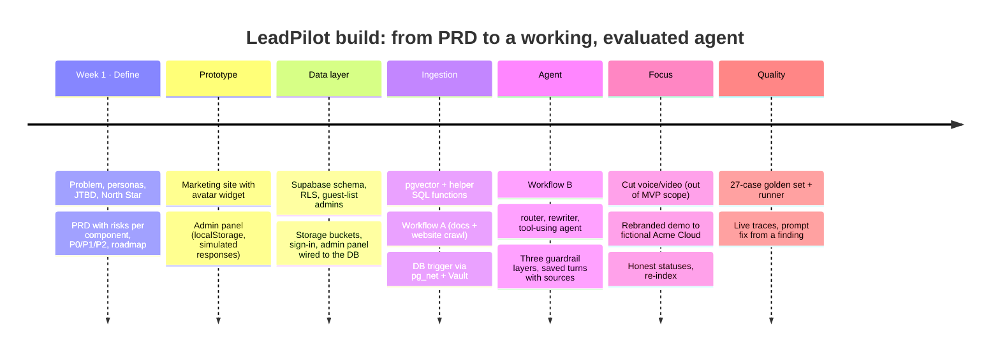
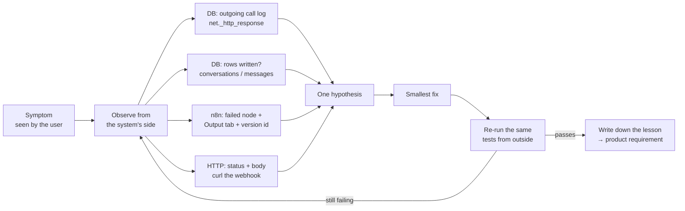

# Build journal

How LeadPilot was built, in order: what I did, what broke, how I diagnosed it, and the **product lesson** each problem taught me. The bugs were mostly configuration, not AI. That's the most useful finding for anyone shipping an AI product to non-technical admins.

## Timeline

## Issues hit, and what they taught me

| # | Symptom | Root cause (how I found it) | Fix | Product lesson |
|---|---|---|---|---|
| 1 | Upload failed: *"invalid URL 'PASTE_N8N_PRODUCTION_URL'"* | The setup snippet's **placeholder** was saved into Vault as-is | Stored the real URL; **made the trigger fail-soft** so a bad setting logs a warning instead of blocking the upload | A side system must never block the core action. Placeholders need to be impossible to miss |
| 2 | Upload saved, but nothing happened in n8n | The database's outgoing-call log showed n8n answering **404 "No workspace here"**: the example value `YOUR-NAME` had been pasted | Put in the real workspace URL | Verify configuration *from the system's side* (response logs), not from "I did it" |
| 3 | Still nothing in n8n Executions | The saved URL was the **test** webhook (`/webhook-test/…`), which only works while the editor is listening | Switched to the production URL | Test and prod endpoints that look almost identical are a trap. A "test connection" button would prevent this |
| 4 | 404 *"webhook is not registered"* | The workflow was built but **never published**. In this n8n version, *Publish* replaced the old *Active* toggle | Published Workflow A | "Saved" and "live" are different states. The UI must make the live version obvious |
| 5 | Agent kept failing after edits | Edits were saved as a **draft**; production still ran the old version (the same version id across runs gave it away) | Re-published; checked the version id changed | Always check *which version* ran, not just *that* it ran |
| 6 | *"Referenced node doesn't exist"* | The code referenced `Validate input`, but the node was named `Validate Input`. Node names are case-sensitive | Made the code read from the Webhook node instead of depending on a renamable name | Design for how people will really configure things, not how the guide says to |
| 7 | Build-rules node failed on an empty editor | The code paste hadn't taken; the editor only showed n8n's placeholder text | Re-pasted via clipboard | Empty states should look *empty*, not like content |
| 8 | OpenAI: *"Bad request - please check your parameters"* | The newest "mini" models are reasoning models that **reject a temperature setting** | Switched classifier and rewriter nodes to `gpt-4.1-mini` (supports temperature 0) | Model choice is a product decision: determinism, latency and cost differ by model family |
| 9 | Workflow "succeeded", but the website said *"couldn't reach the server"* | The response was **HTTP 200 with an empty body**, and nothing was saved. The Post-check outputs weren't wired to *Send reply*, so the run ended without responding | Connected every branch to *Send reply* | "Green" doesn't mean "correct": success needs an end-to-end check (response body + DB write) |
| 10 | Greeting ("Hi there!") returned an empty reply | Same class of bug: the *Direct reply* branch wasn't connected onward | Wire Direct reply → Collect sources (being applied) | Every branch of an agent needs a test case, which is why the golden set has small-talk cases |
| 11 | "Do you integrate with Zoho CRM?" got a speculative answer | Grounded (didn't invent Zoho) but guessed at "API workarounds" | Tightened grounding rule 4: *don't speculate about workarounds or "possible" options* (being applied, re-tested in the eval run) | Writing evals *is* discovery: "no hallucinated facts" and "no speculation" are two different requirements |
| 12 | Designing the evals exposed a conflict | "Is there a discount for annual billing?" is published pricing, but "Discounts" is a blocked topic | Kept it as a deliberate eval edge case | Guardrails need **intent, examples and exceptions**, not keyword lists: a requirement for the admin UI |

## How I debugged: the method that worked

The pattern that kept paying off: **never trust "it's done"; check what the system actually recorded.** Each issue was diagnosed from evidence (a status code, an empty body, a version id, a missing row) before anything was changed.

## Product requirements that came out of this

These are now on the roadmap because building the MVP surfaced them:
1. **"Test connection" for integrations** (issues 1–4): validate the webhook URL and secret the moment they're saved.
2. **A "live version" indicator** (issues 4–5): show admins exactly what prospects are talking to.
3. **Guardrails with examples and exceptions** (issue 12): e.g. *"Discounts: don't negotiate; published annual pricing is OK."*
4. **An end-to-end health check** (issues 9–10): a synthetic question every hour; alert if the reply is empty or not saved.
5. **An eval on every change** (issues 10–11): run the golden set before publishing a prompt or workflow change.
