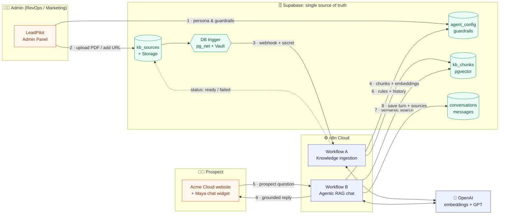
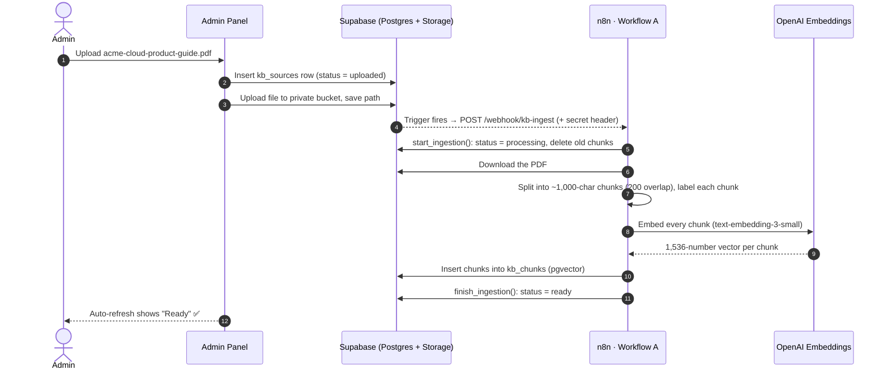
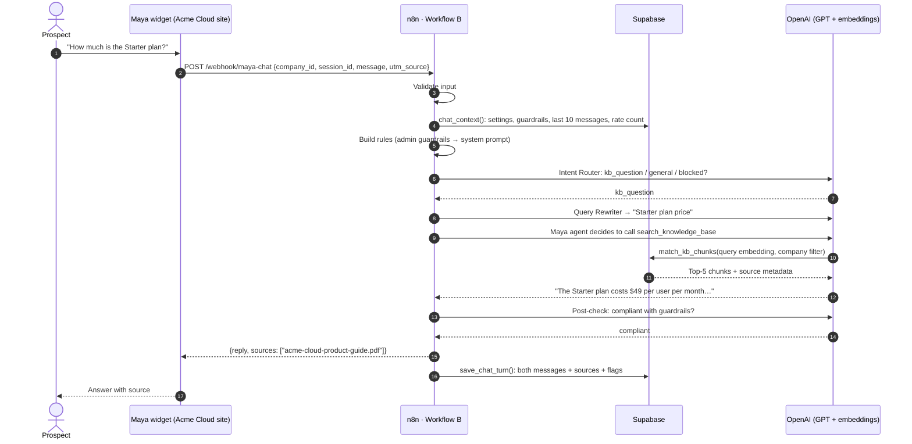

# Workflows: how LeadPilot works end to end

LeadPilot runs on **two n8n workflows** connected through **Supabase**. This page shows how everything fits together. The two deep dives explain every node.

| Workflow | Job | Deep dive |
|---|---|---|
| **A · Knowledge ingestion** | Turns a PDF, DOCX or website into searchable, labelled knowledge | [workflow-a-kb-ingestion.md](workflow-a-kb-ingestion.md) |
| **B · Maya chat (agentic RAG)** | Answers a prospect from that knowledge, inside the admin's guardrails | [workflow-b-agentic-rag.md](workflow-b-agentic-rag.md) |

How it was built, what broke, and what I learned: **[build journal](../build-journal.md)**.

---

## The big picture

**Reading the diagram:** the admin panel never calls n8n directly. It only writes to Supabase, and Supabase triggers n8n. Both workflows read their settings from Supabase on every run. That's why a guardrail saved in the admin panel applies to Maya's **very next** reply, with no deploy and no sync job.

## Flow 1: an admin adds knowledge

## Flow 2: a prospect asks Maya a question

## What each part is responsible for

| Layer | Owns | Why it lives there |
|---|---|---|
| **Admin panel** | Configuration UX | Non-technical admins change agent behaviour without code |
| **Supabase** | Data, security, business rules (RLS, SQL functions, triggers) | One source of truth; security enforced where the data lives |
| **n8n** | Orchestration: calling models, branching, retries, error paths | Visual, inspectable pipelines; each run is logged and replayable |
| **OpenAI** | Embeddings (meaning → numbers) and language (classify, rewrite, answer, review) | Best-in-class models behind one API key and one spending cap |
