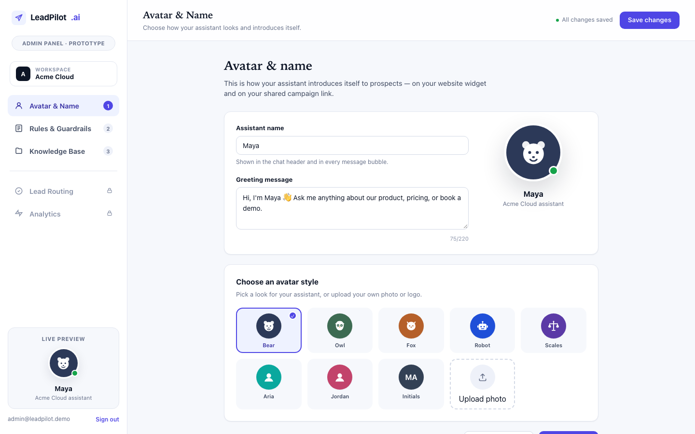
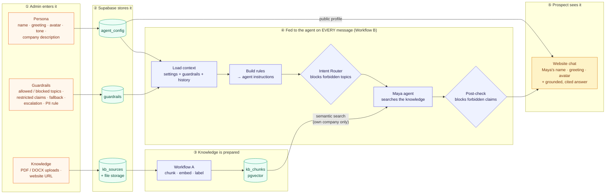
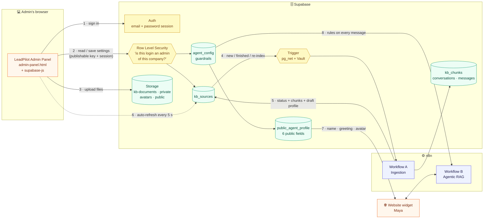
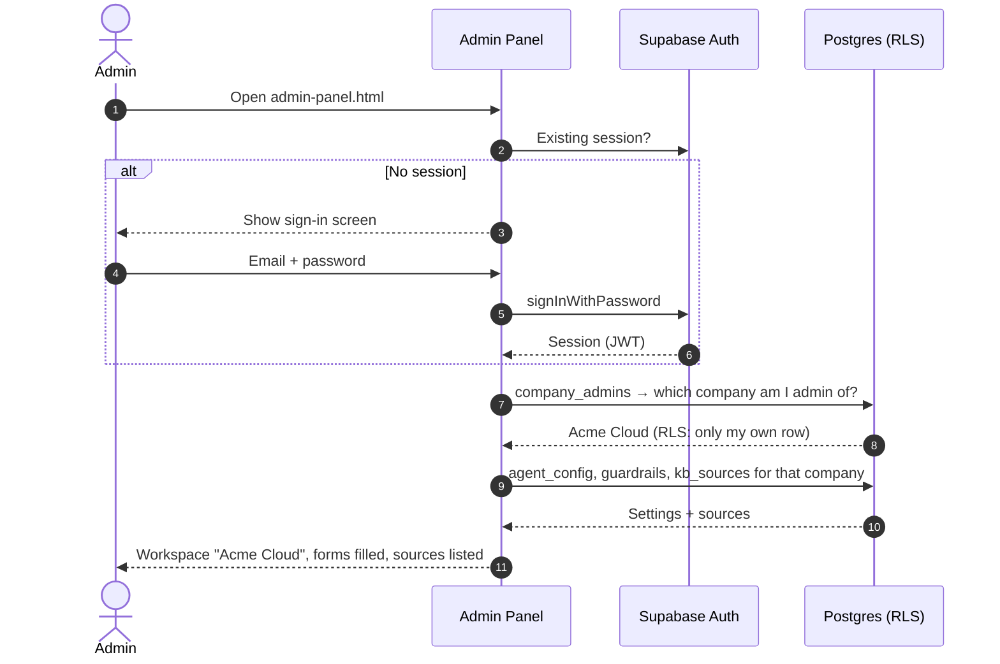
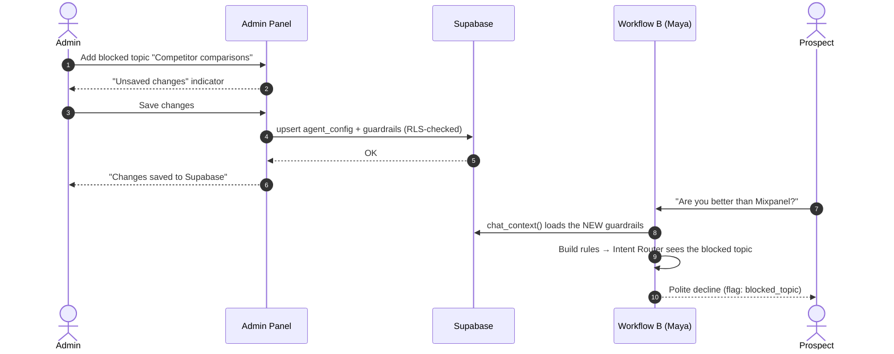
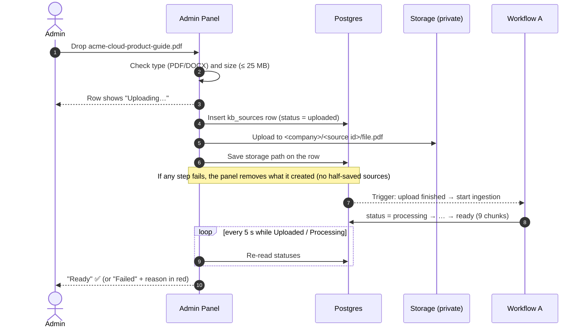
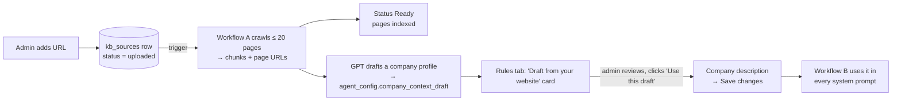

# Admin Panel: how the company controls its agent

**Job:** let a non-technical admin (RevOps or Marketing Ops) set up and control the AI sales agent (who it is, what it knows, what it may and may not say) **without code**, and see honestly whether its knowledge is ready.

**Who uses it:** the *Admin persona* from the [PRD](../PRD.md) · **Built with:** one HTML file + the Supabase JavaScript client · **File:** [`admin-panel/admin-panel.html`](../../admin-panel/admin-panel.html)

← [Workflows overview](README.md) · [Workflow A: Ingestion](workflow-a-kb-ingestion.md) · [Workflow B: Agentic RAG](workflow-b-agentic-rag.md)

---

## Data flow in one picture: from the admin panel to the agent on the website

### Walkthrough

1. **The admin enters three kinds of information** in the admin panel:
   - **Persona**: who the agent is (name, greeting, avatar, tone, company description).
   - **Guardrails**: what it may and may not say (allowed and blocked topics, restricted claims, the fallback message, when to escalate to sales, which personal details it may ask for).
   - **Knowledge**: what it knows (uploaded PDFs/DOCX and the company website).
2. **Supabase stores all of it**, each in its own table, secured so each company only ever sees its own data. The admin panel's job ends here: it never talks to the AI directly.
3. **Knowledge gets prepared once, in the background.** A new document or URL triggers **Workflow A**, which splits it into chunks, turns each chunk into an embedding (a numeric "meaning" fingerprint), labels it with the company, source and page, and stores it in the vector database. The admin sees *Uploaded → Processing → Ready*.
4. **Everything is fed to the agent fresh on every message.** When a prospect sends a message, **Workflow B**:
   - **loads** the persona, guardrails and recent chat history in one call;
   - **builds the agent's instructions** from them;
   - **routes** the message: the Intent Router refuses blocked topics before the agent even runs;
   - **searches** the prepared knowledge, filtered to this company only, so the agent can answer and cite a source;
   - **reviews** the drafted reply in the Post-check, which replaces it with the fallback message if it breaks a guardrail.
5. **The prospect sees the result on the website:** the admin's chosen name, greeting and avatar, plus an answer grounded in the company's own knowledge, or an honest "I don't have that information."

### When does a change take effect?

| The admin changes… | It reaches the agent… | Because |
|---|---|---|
| A guardrail, tone or company description | **On the next message** | Workflow B reloads them for every message |
| Name, greeting or avatar | **On the next page load** of the website | The widget reads the public profile when it opens |
| Knowledge (upload, URL, re-index) | **About 30 seconds later**, once the status is *Ready* | Workflow A has to chunk and embed it first |
| Deleting a source | **Immediately** | Its chunks are deleted with it, so search can't find them |

---

## The screens

| Screen | What the admin does there | Stored in |
|---|---|---|
| **Sign in** | Email + password (Supabase Auth). Public sign-up is disabled | `auth.users` + `company_admins` |
| **Workspace card** | Shows which customer company is being configured (e.g. *Acme Cloud*) | `companies` |
| **1 · Avatar & Name** | Agent name, greeting, avatar style or uploaded photo, with a live preview | `agent_config` + `avatars` bucket |
| **2 · Rules & Guardrails** | Company description, tone, allowed topics, blocked topics, restricted claims, fallback message, escalation rule, which personal details the agent may ask for, and a **draft profile from the website crawl** to review | `agent_config`, `guardrails` |
| **3 · Knowledge Base** | Add a website URL, upload PDF/DOCX, set each source's category, and watch **live status** (Uploaded → Processing → Ready / Failed + reason) with **Re-index** and **Delete** | `kb_sources` + `kb-documents` bucket |
| Lead Routing · Analytics | Locked, on the roadmap (P1) | n/a |

## How the admin panel is connected

**The key design idea: the admin panel only talks to Supabase.** It never calls n8n and never talks to the AI directly:
- **Settings** are written to `agent_config` and `guardrails`. Workflow B reads them on **every message**, so a change applies to the agent's **next reply**, with no deploy.
- **Knowledge** is written to `kb_sources` and Storage. A database trigger starts Workflow A; the panel watches the status.
- The **website widget** reads the name, greeting and avatar from a public view, so branding changes appear on the site on the next page load.

### Who can do what (security)

| Actor | Connects with | Can access |
|---|---|---|
| **Signed-in admin** (admin panel) | Publishable key + login session | Only rows of **their own company**: RLS checks the `company_admins` guest list on every read and write. Files only inside their company's storage folder |
| **Anyone else with the page** | Publishable key, not signed in | Nothing. Sign-up is disabled; every table is locked |
| **Website visitor** (widget) | Publishable key | Only the 6-field `public_agent_profile` view (name, greeting, avatar, tone) |
| **n8n** | `service_role` key, stored only in n8n | Everything, and the only caller allowed to run the RAG SQL functions |

The publishable key sitting in the HTML is safe **because** of RLS. This was tested: signed-out requests to read guardrails, edit the agent or add sources are all rejected.

---

## Flow 1: Sign in and load the workspace

If the login isn't on the guest list, the panel says so instead of showing an empty form, because a login alone gives no access.

## Flow 2: Change a setting (e.g. add a blocked topic)

No deploy, no restart: **the next message uses the new rule.**

## Flow 3: Upload a document

## Flow 4: Add the company website

The AI **drafts** and the human **decides**. The crawl never overwrites the admin's own description (PRD requirement 2b).

## Flow 5: Re-index and delete

| Action | What happens | Why |
|---|---|---|
| **↻ Re-index** | Status flips back to *uploaded* → the trigger fires → Workflow A **deletes the old chunks**, then rebuilds | Updated documents never leave stale answers behind |
| **🗑 Delete** | File removed from Storage, row deleted → its chunks are **cascade-deleted** by the database | Once deleted, the agent can no longer answer from it (PRD acceptance criterion) |
| **Change category** | Saved immediately; **does not** re-trigger ingestion | Avoids wasted AI runs |

---

## Every admin setting → where it changes the agent

| Admin panel field | Stored as | Used by | Effect on Maya |
|---|---|---|---|
| Assistant name | `agent_config.agent_name` | Widget header · Build rules | "Hi, I'm **Maya**" · *"You are Maya…"* |
| Greeting | `agent_config.greeting` | Widget | First message in the chat |
| Avatar style / photo | `avatar_style`, `avatar_url` (+ `avatars` bucket) | Widget, admin preview | Custom photo shown on the site |
| Tone | `agent_config.tone` | Build rules | "Be professional and clear…" |
| Company description | `agent_config.company_description` | Build rules (*## Company*) | Background the agent may answer from |
| Draft from website | `agent_config.company_context_draft` | Rules tab (review only) | Nothing until the admin accepts it |
| Allowed topics | `guardrails.allowed_topics` | Build rules | Listed as topics it may discuss |
| **Blocked topics** | `guardrails.blocked_topics` | Build rules · **Intent Router** · **Post-check** | Refused before *and* after the agent runs |
| **Restricted claims** | `guardrails.restricted_claims` | Build rules · **Post-check** | Replies making them are replaced by the fallback |
| **Fallback message** | `guardrails.fallback_message` | Build rules (rule 4) · Use fallback node | Exact reply when the knowledge base can't answer |
| Escalation rule | `guardrails.escalation_rule` | Build rules · Direct reply | When to offer a demo or sales |
| Personal-data rule | `guardrails.pii_rule` | Build rules | Which details it may ask for (none / name + email / + company and role) |
| Knowledge sources | `kb_sources` + `kb-documents` | Trigger → Workflow A → `kb_chunks` | What the agent can search and cite |
| Source category | `kb_sources.category` → chunk metadata | Vector search filter | Lets search be narrowed (e.g. Pricing) |

## Product decisions in the admin panel

| Decision | Why |
|---|---|
| **Real login + Row Level Security, even for a prototype** | The key in the HTML is public; without RLS anyone could rewrite the agent's guardrails |
| **Settings save on "Save changes"; knowledge changes save instantly** | Guardrails are edited as a set and reviewed together; uploads and deletes are single, obvious actions |
| **Honest statuses instead of a fake "Ready" animation** | The admin must know exactly what the agent can answer from |
| **Failed sources show the reason** | Makes failures fixable by the admin, not just by an engineer |
| **Upload is all-or-nothing** | If storage or the database fails midway, the panel rolls back, so there are no ghost sources |
| **The AI drafts the company profile; the admin approves it** | Keeps a human in the loop for what the agent says about the company |
| **Branded as LeadPilot, with the customer as a "workspace"** | It's a B2B SaaS: the admin tool is the vendor's, and the widget is the customer's |

## Known limitations (next iterations)
- Qualification criteria and the **Leads view** (PRD 2d, 2f) are the next screens to build.
- No version history of guardrail changes yet (PRD: *"store config change history"*).
- No "test connection" button or preview-the-agent sandbox yet. Both came out of the [build journal](../build-journal.md).
- Single admin per company in the demo; the data model already supports several.
