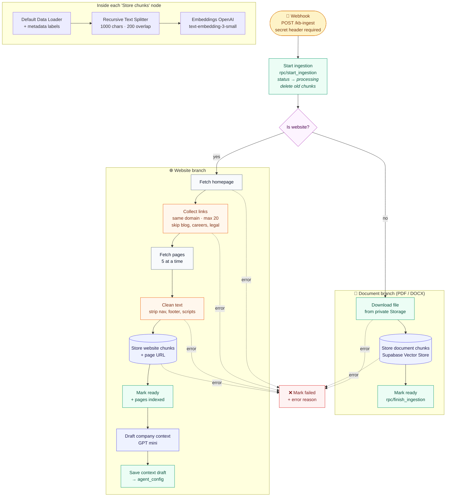
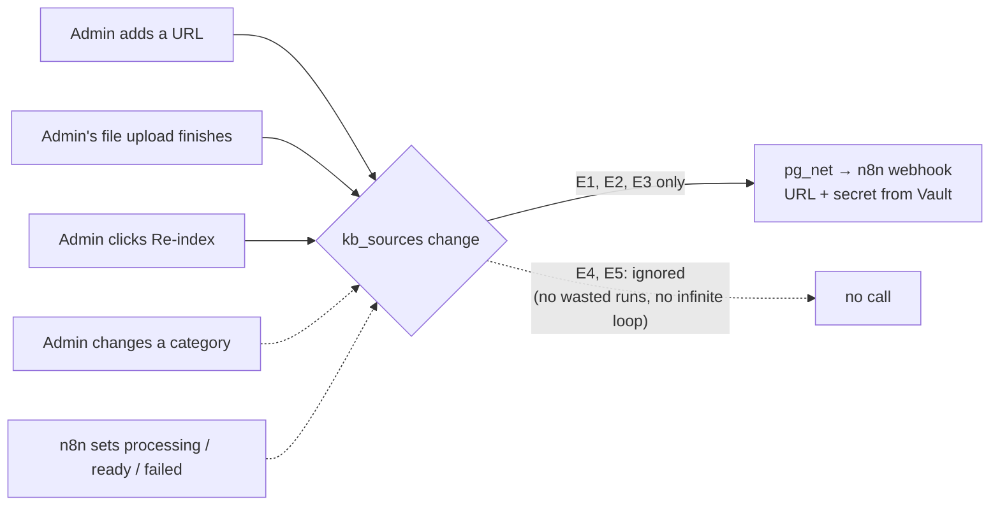

# Workflow A: Knowledge ingestion

**Job:** when an admin uploads a document or adds a website in the LeadPilot admin panel, turn it into **searchable, labelled knowledge** that Maya can cite, automatically, with an honest status the admin can see.

**Type:** event-driven ETL pipeline (extract → transform → load) · **Trigger:** Supabase database webhook · **Runs on:** n8n Cloud

← [Workflows overview](README.md) · [Workflow B: Agentic RAG](workflow-b-agentic-rag.md) →

---

## Flow diagram



**Legend:** 🟨 trigger · 🟩 database call · 🟪 AI / vector step · 🟧 custom code · ⬜ HTTP step · 🟥 error path

## What each node does, and why

| # | Node | What it does | Why it's designed this way |
|---|---|---|---|
| 1 | **Webhook** | Receives `{source_id}` from Supabase | **Header Auth** with a shared secret, so only my database can start ingestion, even though the URL is public |
| 2 | **Start ingestion** | One SQL function: marks the source *processing*, **deletes its old chunks**, returns the row | Re-indexing is clean (no duplicate chunks), and the admin sees a spinner immediately |
| 3 | **Is website?** | Routes on `source_type` | Documents and websites are read in completely different ways |
| 4 | **Download file** | Fetches the file from the **private** storage bucket with the service key | Prospect-facing agents need internal docs; the bucket is never public |
| 5 | **Store document chunks** | Loads the PDF/DOCX → splits → embeds → writes to `kb_chunks` | See "chunking and labels" below |
| 6 | **Mark ready** | Status → *ready*, `indexed_at` set · **Execute Once** | Without *Execute Once* it would run once **per chunk** |
| 7–10 | **Fetch homepage → Collect links → Fetch pages → Clean text** | A small, polite crawler: same domain only, max 20 pages, 5 at a time, strips menus and footers | Menus and footers repeat on every page; left in, they'd fill the KB with duplicate "Home · Pricing · Contact" chunks |
| 11 | **Store website chunks** | Same as #5, plus `page_url` and `page_title` labels | So Maya can cite *which page* an answer came from |
| 12–14 | **Mark ready → Draft company context → Save draft** | GPT writes a 180-word company profile from the crawl into a *draft* field | PRD requirement: auto-draft the context for the admin to **review**. It never overwrites their text |
| 15 | **Mark failed** | Any error output → status *failed* + the error reason | The admin sees **Failed: reason** instead of an endless spinner, and can click Re-index |

### Chunking and labels (the RAG foundation)

Every chunk is stored with **metadata labels**. Here's a real one from the Acme Cloud guide:

```jsonc
{
  "company_id":  "3fbdd46d-…",            // multi-tenant isolation: search is always filtered by this
  "source_id":   "d3cc6409-…",            // deleting the source cascades to its chunks
  "source_type": "pdf",
  "source_name": "acme-cloud-product-guide.pdf",   // what Maya cites
  "category":    "Product",               // lets search be narrowed to e.g. Pricing
  "loc": { "pageNumber": 1 }              // "Source: …pdf, p. 1"
}
```

| Choice | Value | Reasoning |
|---|---|---|
| Chunk size | 1,000 characters | About one idea per chunk: specific enough to match a question, big enough to answer it |
| Overlap | 200 characters | A sentence cut at a boundary still appears whole in one of the two chunks |
| Embedding model | `text-embedding-3-small` (1,536 dimensions) | Cheap and strong. **Must be identical in Workflow B**, or question and chunks are measured on different scales |
| Index | pgvector HNSW, cosine distance | Fast approximate nearest-neighbour search inside Postgres, with no separate vector DB |

## How it's triggered (and why not from the browser)



A Postgres trigger calls n8n only for the three events that need processing. The n8n URL and secret are kept in **Supabase Vault**, not in code. If the call can't be sent (say, a misconfigured URL), the trigger **logs a warning instead of blocking the upload**. That rule came from a real incident, described in the [build journal](../build-journal.md).

## Results (live run)

| Check | Result |
|---|---|
| Source | `acme-cloud-product-guide.pdf` (4 pages) |
| Status in admin panel | Uploaded → Processing → **Ready**, with no manual refresh |
| Chunks written | **9**, each 81–995 characters, each with a 1,536-d embedding |
| Labels | company, source, file name, category and **page number** on every chunk |
| Spot check | The pricing chunk ("Starter … $49") is present and later retrieved by Maya |

## How to rebuild it
Field-by-field settings: [docs/setup.md, section 3](../setup.md#3-workflow-a-kb-ingestion) · Code nodes: [`a-collect-links.js`](../../n8n/code/a-collect-links.js), [`a-clean-text.js`](../../n8n/code/a-clean-text.js) · SQL: [`05_rag.sql`](../../supabase/05_rag.sql), [`06_ingest_trigger.sql`](../../supabase/06_ingest_trigger.sql)
