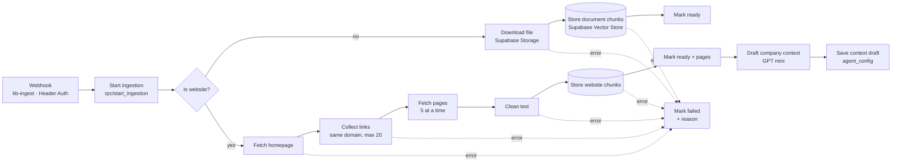
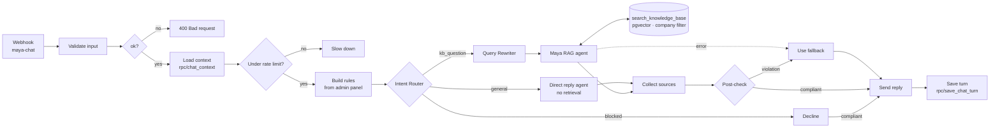

# n8n workflows

> 📘 **Start here for the full story:** [workflow deep dives with diagrams and real traces](../docs/workflows/README.md) and the [build journal](../docs/build-journal.md). This page is the compact technical reference.

LeadPilot's two back-end workflows run on n8n Cloud. Supabase is the source of truth; n8n does the work.

| Workflow | Trigger | Job |
|---|---|---|
| **A · KB Ingestion** | Supabase database trigger → webhook `kb-ingest` (secret header) | Turn an uploaded PDF/DOCX or a website URL into searchable, labelled chunks in pgvector |
| **B · Maya chat (Agentic RAG)** | Website widget → public webhook `maya-chat` | Answer a prospect using the company's KB, inside the admin's guardrails |

> **Workflow JSON exports:** [`workflows/workflow-a-kb-ingestion.json`](workflows/workflow-a-kb-ingestion.json) and
> [`workflows/workflow-b-maya-chat.json`](workflows/workflow-b-maya-chat.json). Exports don't include credential secrets.
> The Code-node scripts are also in [`code/`](code/) so they're readable on GitHub.
>
> **To import:** in n8n, **Workflows → ⋯ → Import from file**, re-select the *Supabase LeadPilot*, *OpenAI - LeadPilot*
> and *LeadPilot ingest secret* credentials if n8n asks, then **Publish**. Both files import as inactive so they don't
> clash with the live copies; deactivate the old version before publishing the new one, because the webhook paths are the same.

## Check a workflow before publishing

```bash
python3 n8n/tools/check_workflow.py n8n/workflows/*.json
```

[`tools/check_workflow.py`](tools/check_workflow.py) reads an export and fails on the wiring mistakes that make a run look
green while the widget gets nothing back (build journal issues 9 and 10). It needs no n8n instance and only the Python standard library.

| Check | Catches |
|---|---|
| Unwired branch | An IF, Text Classifier (including its *other* output) or error output with no connection |
| No response | A node on the chat webhook from which no path reaches *Respond to Webhook* |
| Not an expression | A field containing `{{ }}` without the leading `=`, so n8n sends the braces as literal text |
| Missing auth | An HTTP Request to Supabase without the Supabase credential |

### Fixes in the 2026-09-29 exports

The exports from 2026-09-28 had 13 problems. All are fixed in the files above (checker result: 0 problems).

| Workflow | Problem | Effect before | Fix |
|---|---|---|---|
| A | Error outputs of *Download file*, *Collect links*, *Fetch pages*, *Clean text* not connected | A failed source stayed on *Processing* forever | All four, plus both *Store … chunks* nodes, route errors to *Mark failed* |
| A | *Mark ready (website)* and *Mark failed* had no Supabase credential | Supabase rejects the call, so websites never became *Ready* and failures were never recorded | Added the credential |
| A | Website pages had no text splitter; document overlap was 100 | Different chunking for web and PDF; docs said 1000 / 200 | Both use a 1000 / 200 splitter |
| B | *Maya agent* and *Direct reply* system messages weren't expressions | The agent could receive `{{ … }}` as literal text instead of the admin's rules and guardrails | Switched to expressions (`=`) |
| B | *Direct reply* had no outgoing connection | Greetings and demo requests got an empty response (issue 10) | *Direct reply* → *Direct reply output* → *Post-check* |
| B | *Under rate limit?* false branch not connected | Rate-limited visitors got no response | New *Rate limited* node returns HTTP 429 with a friendly message |
| B | *Intent Router* "other" output not connected | Unclassifiable messages got no response | Sent to the *Query Rewriter* (try the knowledge base) |
| B | *Maya agent* error output not connected | A model timeout meant no response | *Agent error fallback* returns the admin's fallback message, flag `agent_error` |
| B | *Post-check* "other" went straight to *Send reply* | A reply the checker couldn't classify was sent unchecked (fail-open) | *Post-check uncertain* returns the fallback, flag `postcheck_uncertain` (fail-closed) |
| B | *Bad request* body wasn't an expression | Invalid requests got literal braces back | Switched to an expression |
| B | Answer model at temperature 0.6, top-k unset | Didn't match the documented 0.2 and top-5 | Set to 0.2 and top-5 |

**One thing to verify after import:** *Save context draft* reads `$json.message.content` from the OpenAI node. If the company
context draft stays empty after a website ingest, check that node's output shape in the execution log and update the field.

---

## Workflow A: KB Ingestion



| Step | Why |
|---|---|
| `start_ingestion` (SQL function) | One call marks the source *processing*, **deletes its old chunks** (clean re-index) and returns the row |
| Default Data Loader + Recursive splitter (1000 / 200) | Paragraph-sized chunks; the overlap keeps sentences cut at a boundary intact |
| Metadata on every chunk: `company_id, source_id, source_type, source_name, category` (+ `page_url`, `page_title` for web, page number for PDFs) | Company isolation, cascade-delete, category filtering and **citations** |
| `text-embedding-3-small` (1536-d) | Cheap, strong; must be the same model in Workflow B |
| Error outputs → `finish_ingestion(failed, reason)` | The admin sees *Failed + why* instead of an endless spinner |
| Context draft (URLs only) | PRD 2b: the crawl drafts company context for the admin to review, never overwriting it |

## Workflow B: Maya chat (Agentic RAG)



**What makes it agentic:** the Intent Router decides whether retrieval is needed at all. The Query Rewriter turns follow-ups like *"how much is that one?"* into standalone search queries. The agent decides when to call the search tool, judges the results, and **re-searches with new wording (max 3)** before falling back instead of guessing.

**Guardrails from the admin panel, three layers:**
1. **Rules:** `Build rules` turns agent name, tone, company description, allowed and blocked topics, restricted claims, fallback, escalation and PII rule into the system prompt, fresh on every message.
2. **Pre-check:** the Intent Router sends blocked, off-topic and injection attempts to a polite decline before the agent runs.
3. **Post-check:** a classifier reviews the drafted reply against blocked topics and restricted claims; violations become the fallback.

| Node | Key settings |
|---|---|
| Webhook | POST `maya-chat`, respond via *Respond to Webhook*, CORS `*` |
| Load context | `rpc/chat_context`: settings, guardrails, last 10 messages, message count in last 10 min |
| Under rate limit? | `< 20` messages per session per 10 min (the OpenAI budget cap is the real backstop) |
| Maya agent | Tools Agent, max iterations 6, return intermediate steps, temperature 0.2 |
| search_knowledge_base | Supabase Vector Store *as tool*, table `kb_chunks`, query `match_kb_chunks`, top-5, metadata filter `company_id` |
| Send reply → Save turn | Reply first (latency), then persist both messages + sources via `rpc/save_chat_turn` |

Step-by-step build instructions (every field and expression) are in [`../docs/setup.md`](../docs/setup.md).
