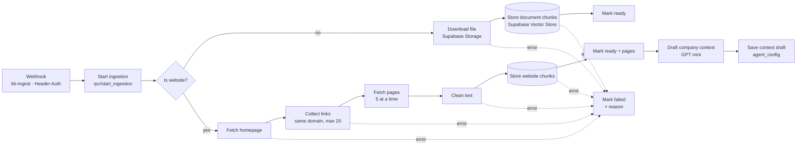
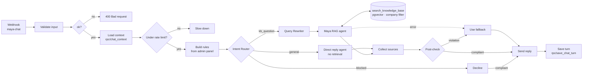

# n8n workflows

> 📘 **Start here for the full story:** [workflow deep dives with diagrams and real traces](../docs/workflows/README.md) and the [build journal](../docs/build-journal.md). This page is the compact technical reference.

LeadPilot's two back-end workflows run on n8n Cloud. Supabase is the source of truth; n8n does the work.

| Workflow | Trigger | Job |
|---|---|---|
| **A · KB Ingestion** | Supabase database trigger → webhook `kb-ingest` (secret header) | Turn an uploaded PDF/DOCX or a website URL into searchable, labelled chunks in pgvector |
| **B · Maya chat (Agentic RAG)** | Website widget → public webhook `maya-chat` | Answer a prospect using the company's KB, inside the admin's guardrails |

> **Workflow JSON exports:** in n8n, open each workflow → **⋯ → Download**, and save the files here as
> `workflow-a-kb-ingestion.json` and `workflow-b-maya-chat.json`. Exports don't include credential secrets.
> The Code-node scripts are also in [`code/`](code/) so they're readable on GitHub.

---

## Workflow A: KB Ingestion

| Step | Why |
|---|---|
| `start_ingestion` (SQL function) | One call marks the source *processing*, **deletes its old chunks** (clean re-index) and returns the row |
| Default Data Loader + Recursive splitter (1000 / 200) | Paragraph-sized chunks; the overlap keeps sentences cut at a boundary intact |
| Metadata on every chunk: `company_id, source_id, source_type, source_name, category` (+ `page_url`, `page_title` for web, page number for PDFs) | Company isolation, cascade-delete, category filtering and **citations** |
| `text-embedding-3-small` (1536-d) | Cheap, strong; must be the same model in Workflow B |
| Error outputs → `finish_ingestion(failed, reason)` | The admin sees *Failed + why* instead of an endless spinner |
| Context draft (URLs only) | PRD 2b: the crawl drafts company context for the admin to review, never overwriting it |

## Workflow B: Maya chat (Agentic RAG)

**What makes it agentic:** the Intent Router decides whether retrieval is needed at all. The Query Rewriter turns follow-ups like *"how much is that one?"* into standalone search queries. The agent decides when to call the search tool, judges the results, and **re-searches with new wording (max 3)** before falling back instead of guessing.

**Guardrails from the admin panel, three layers:**
1. **Rules:** `Build rules` turns agent name, tone, company description, allowed and blocked topics, restricted claims, fallback, escalation and PII rule into the system prompt, fresh on every message.
2. **Pre-check:** the Intent Router sends blocked, off-topic and injection attempts to a polite decline before the agent runs.
3. **Post-check:** a classifier reviews the drafted reply against blocked topics and restricted claims; violations become the fallback.

| Node | Key settings |
|---|---|
| Webhook | POST `maya-chat`, respond via *Respond to Webhook*, CORS `*` |
| Load context | `rpc/chat_context`: settings, guardrails, last 10 messages, message count in last 10 min |
| Under rate limit? | `< 20` messages per session per 10 min (the OpenAI budget cap is the real backstop) |
| Maya agent | Tools Agent, max iterations 6, return intermediate steps, temperature 0.2 |
| search_knowledge_base | Supabase Vector Store *as tool*, table `kb_chunks`, query `match_kb_chunks`, top-5, metadata filter `company_id` |
| Send reply → Save turn | Reply first (latency), then persist both messages + sources via `rpc/save_chat_turn` |

Step-by-step build instructions (every field and expression) are in [`../docs/setup.md`](../docs/setup.md).
